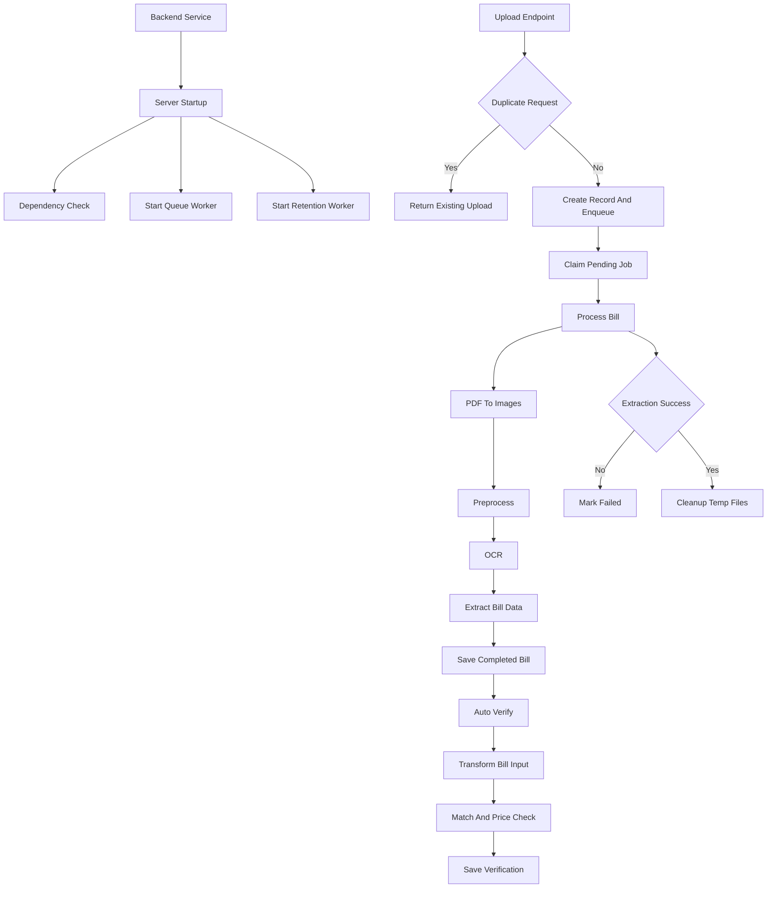
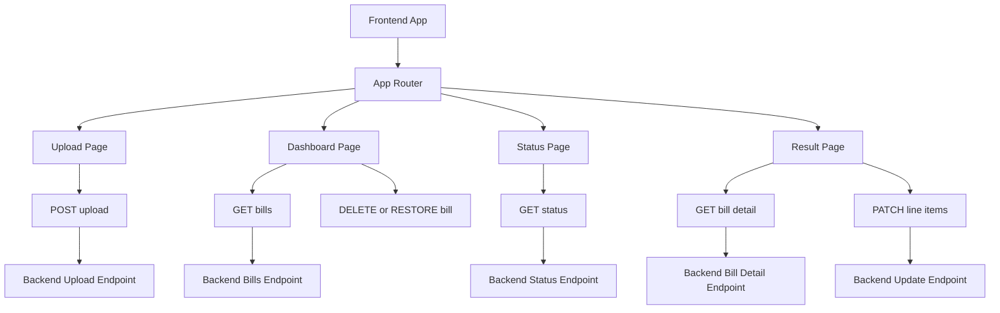
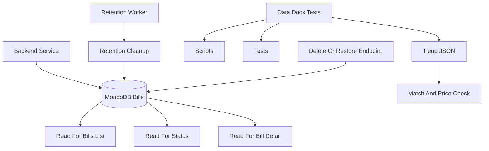
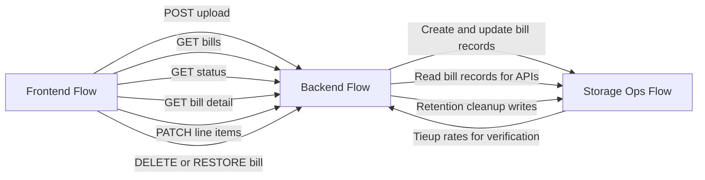

# Project Roadmap

## Backend Flow

```mermaid
flowchart TD
    A[Backend Service] --> BE1[Server Startup]
    BE1 --> BE2[Dependency Check]
    BE1 --> BE3[Start Queue Worker]
    BE1 --> BE4[Start Retention Worker]

    BE5[Upload Endpoint] --> Q1{Duplicate Request}
    Q1 -->|Yes| Q2[Return Existing Upload]
    Q1 -->|No| Q3[Create Record And Enqueue]

    Q3 --> W1[Claim Pending Job]
    W1 --> W2[Process Bill]
    W2 --> W3[PDF To Images]
    W3 --> W4[Preprocess]
    W4 --> W5[OCR]
    W5 --> W6[Extract Bill Data]
    W6 --> W7[Save Completed Bill]

    W7 --> V1[Auto Verify]
    V1 --> V2[Transform Bill Input]
    V2 --> V3[Match And Price Check]
    V3 --> V4[Save Verification]

    W2 --> E1{Extraction Success}
    E1 -->|No| E2[Mark Failed]
    E1 -->|Yes| E3[Cleanup Temp Files]
```

## Frontend Flow

```mermaid
flowchart TD
    F0[Frontend App] --> FE1[App Router]
    FE1 --> FE2[Upload Page]
    FE1 --> FE3[Dashboard Page]
    FE1 --> FE4[Status Page]
    FE1 --> FE5[Result Page]

    FE2 --> FE6[POST upload]
    FE3 --> FE7[GET bills]
    FE3 --> FE8[DELETE or RESTORE bill]
    FE4 --> FE9[GET status]
    FE5 --> FE10[GET bill detail]
    FE5 --> FE11[PATCH line items]

    FE6 --> API1[Backend Upload Endpoint]
    FE7 --> API2[Backend Bills Endpoint]
    FE9 --> API3[Backend Status Endpoint]
    FE10 --> API4[Backend Bill Detail Endpoint]
    FE11 --> API5[Backend Update Endpoint]
```

## Storage Ops Flow

```mermaid
flowchart TD
    B0[Backend Service] --> DB[(MongoDB Bills)]
    S0[Data Docs Tests] --> T1[Tieup JSON]
    S0 --> T2[Scripts]
    S0 --> T3[Tests]

    R1[Retention Worker] --> R2[Retention Cleanup]
    R2 --> DB

    T1 --> V3[Match And Price Check]
    DB --> Q1[Read For Bills List]
    DB --> Q2[Read For Status]
    DB --> Q3[Read For Bill Detail]
    API[Delete Or Restore Endpoint] --> DB
```

## Integration Points Flow

```mermaid
flowchart LR
    FE[Frontend Flow]
    BE[Backend Flow]
    ST[Storage Ops Flow]

    FE -->|POST upload| BE
    FE -->|GET bills| BE
    FE -->|GET status| BE
    FE -->|GET bill detail| BE
    FE -->|PATCH line items| BE
    FE -->|DELETE or RESTORE bill| BE

    BE -->|Create and update bill records| ST
    BE -->|Read bill records for APIs| ST
    BE -->|Retention cleanup writes| ST
    ST -->|Tieup rates for verification| BE
```
